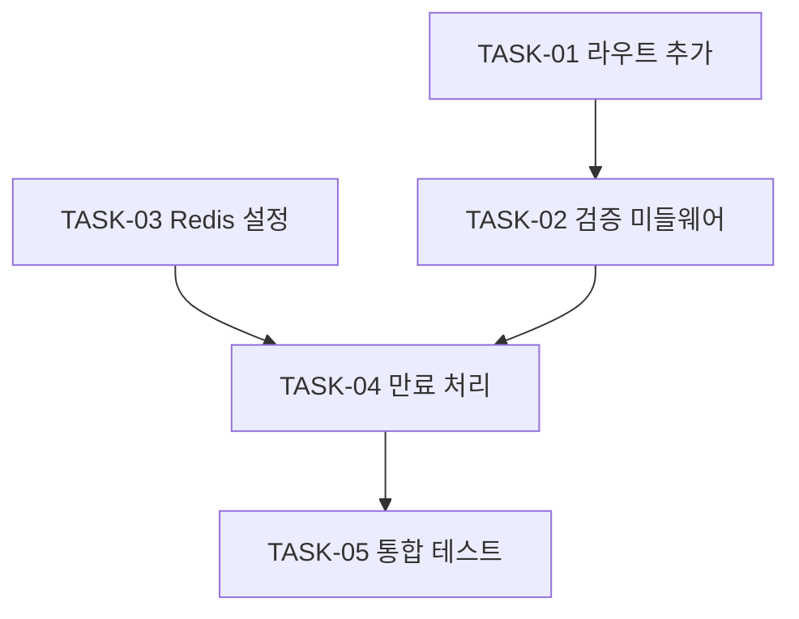

# ISSUE-XXXX — {ISSUE 제목}

> 이 문서는 자동 생성된다. 수동 편집 금지.
> 마지막 갱신: YYYY-MM-DD HH:MM

[ISSUE 본문](./ISSUE.md)

## TASK 목록

| TASK | 종류 | 의존 | 상태 |
|---|---|---|---|
| [TASK-01](./TASK-01.md) — 토큰 갱신 엔드포인트 라우트 추가 | implementation | — | pending |
| [TASK-02](./TASK-02.md) — 토큰 검증 미들웨어 구현 | implementation | TASK-01 | in-progress |
| [TASK-03](./TASK-03.md) — Redis 세션 스토어 설정 | infra | — | pending |
| [TASK-04](./TASK-04.md) — 토큰 만료 처리 로직 | implementation | TASK-02, TASK-03 | pending |
| [TASK-05](./TASK-05.md) — 통합 테스트 작성 | implementation | TASK-04 | pending |

## PLAN 목록

| PLAN | 대응 TASK | 상태 |
|---|---|---|
| [PLAN-03](./PLAN-03.md) | TASK-03 | reviewed |
| [PLAN-02](./PLAN-02.md) | TASK-02 | draft |

## TASK 의존 그래프

---

## 생성 규칙

### 헤더
- 제목 형식: `# {ISSUE-ID} — {ISSUE.md frontmatter의 title}`.
- ISSUE 본문 링크는 같은 디렉터리의 `./ISSUE.md` 고정.
- ISSUE 목적·완료 조건 등 본문 요약은 INDEX에 노출하지 않음. ISSUE.md 링크로 충분.

### TASK 목록 표
- **정렬**: TASK ID 오름차순.
- **TASK 칸**: `[TASK-XX](./TASK-XX.md) — {title}`. TASK frontmatter의 `id`와 `title` 사용.
- **종류 칸**: `primary_kind` 값 그대로 (`implementation` / `refactor` / `infra` / `chore`). `secondary_kinds`는 표시하지 않음 (TASK 본문에서 확인).
- **의존 칸**: `depends_on` 배열을 쉼표 구분. 없으면 `—`. 같은 ISSUE 내 TASK ID만 (다른 ISSUE의 TASK 인용 금지 규칙).
- **상태 칸**: `status` 값 그대로 (`pending` / `in-progress` / `done`).
- **PR 정보 미노출**: `pr_url`은 표에 등장하지 않음. status가 `done`이면 PR 존재가 함의됨. PR 링크는 TASK 본문에서 확인.

### TASK 의존 그래프
- **노드 라벨 형식**: `T{XX}[TASK-XX {제목 단축}]`.
- **제목 단축**: TASK title을 약 10자 이내로 자연스럽게 줄임. 너무 길면 그래프 가독성 해침.
- **화살표**: 각 TASK의 `depends_on`을 source로 그림. `A depends_on: [B]`면 `B --> A`.
- **고립 노드**: 의존 관계 없는 TASK도 그래프에 노드로 등장. 화살표만 없음.
- **방향**: `graph TD` (위→아래).

### PLAN 목록 표
- **정렬**: PLAN ID 내림차순 (최신 위).
- **PLAN 칸**: `[PLAN-XX](./PLAN-XX.md)`. PLAN frontmatter의 `id` 사용.
- **대응 TASK 칸**: `task_ref` 값 그대로.
- **상태 칸**: `status` 값 그대로 (`draft` / `reviewed` / `executed`).
- **PLAN 본문 요약 미노출**: 추적 정보·근거는 PLAN.md 본문에서 확인.

### 빈 ISSUE 처리
- TASK가 0개인 ISSUE의 INDEX:
  - TASK 목록 표는 헤더만 출력하거나, 한 줄 안내 (`_TASK 미작성_`)로 대체.
  - TASK 의존 그래프 섹션 자체를 출력하지 않음.

### 미노출 정보
- ADR 인용은 표시하지 않음. ADR 추적은 ADR INDEX의 역참조 책임.
- 도메인·SPEC 정보는 표시하지 않음. 상위 issues/INDEX 책임.
