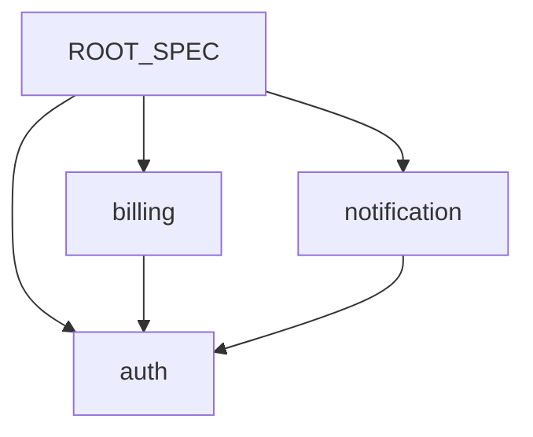

# SPEC 목록

> 이 문서는 자동 생성된다. 수동 편집 금지.
> 마지막 갱신: YYYY-MM-DD HH:MM

## 도메인 목록

| 도메인 | 의존 | 한 줄 설명 |
|---|---|---|
| [auth](./auth/INDEX.md) | — | 사용자 인증과 세션 관리 |
| [billing](./billing/INDEX.md) | auth | 구독·결제 처리 |
| [notification](./notification/INDEX.md) | auth | 사용자 알림 발송 |

## SPEC 의존 그래프

---

## 생성 규칙

- **행 정렬**: 도메인 알파벳 순.
- **의존 칸**: SPEC frontmatter의 `depends_on` 도메인 목록. 없으면 `—`. 여러 개면 알파벳 순 쉼표 구분.
- **한 줄 설명 칸**: SPEC frontmatter의 `summary` 필드 값.
- **빈 도메인 표시 안 함**: SPEC.md가 없는 도메인 디렉터리는 행에 등장하지 않음.
- **그래프 노드 라벨**: 도메인명만. 버전·상태 등 진행성 정보 미포함.
- **그래프 화살표**: ROOT_SPEC을 루트로, 각 SPEC의 `depends_on`을 도메인 간 의존으로.
- **카운트·진척 없음**: UC/EC/ISSUE 양적 정보는 {domain}/INDEX 또는 그 하위 INDEX 책임.
